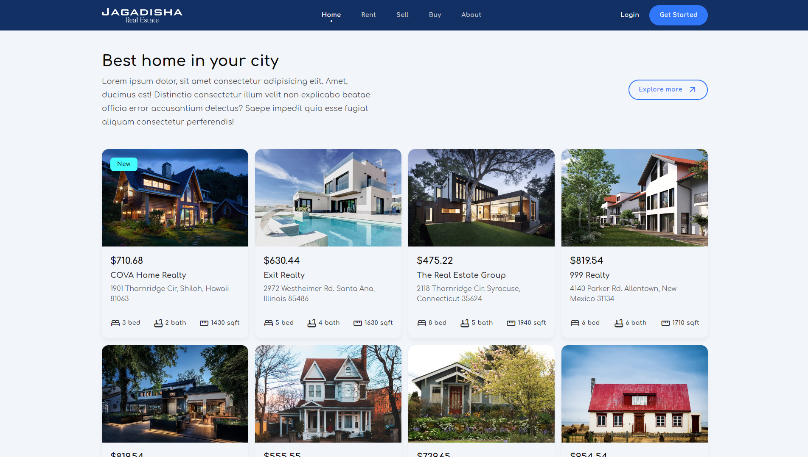

# Real Estate App

Welcome to the **Real Estate App**, a fully responsive and modern web application designed to showcase real estate listings with an intuitive user interface. This project is built using HTML, CSS, and JavaScript, and it features both light and dark themes for an enhanced user experience.

## Features

- **Responsive Design**: The app is designed to work seamlessly across various devices and screen sizes.
- **Property Listings**: Elegant display of property listings with detailed information.
- **Interactive UI**: Smooth navigation and interactive elements for a better user experience.

## Screenshots

## Usage

This project is ideal for developers looking to create or enhance their own real estate web applications. It serves as a solid foundation for further customization and expansion.

## Structure

- **index.html**: The main HTML file containing the structure of the app.
- **styles.css**: The CSS file responsible for the app's styling, including the light and dark themes.
- **script.js**: The JavaScript file handling the interactive features and theme toggling.
- **images/**: The folder containing images used in the app.

---

Thank you for checking out the **Real Estate App**. Happy coding!
